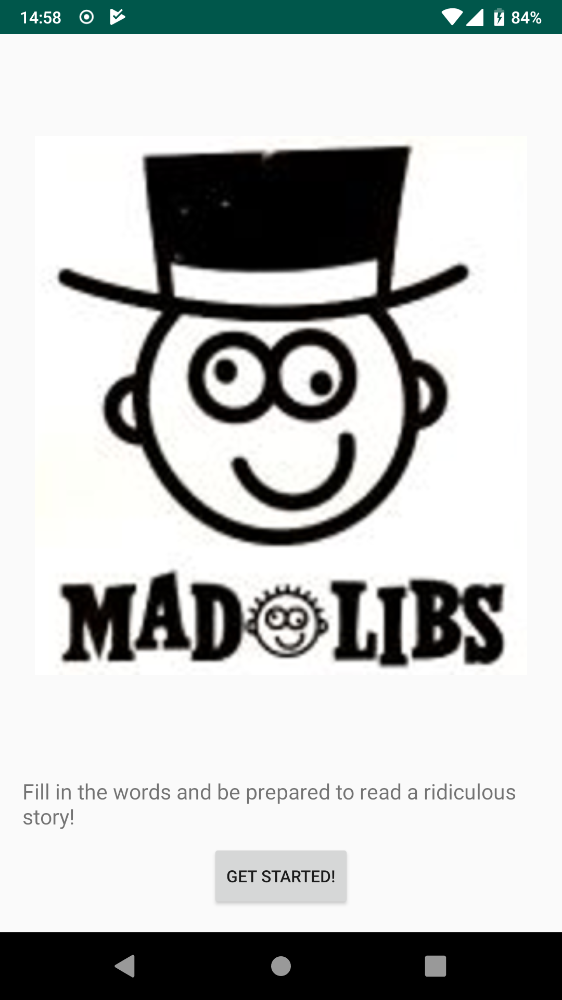
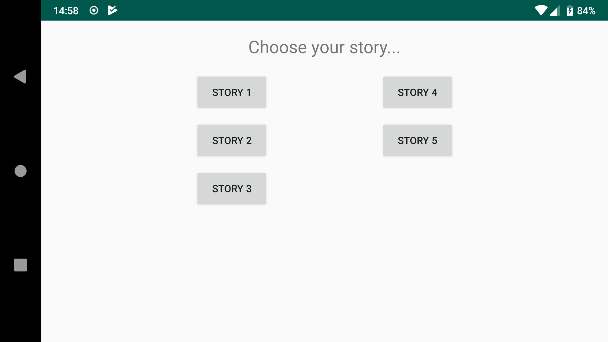
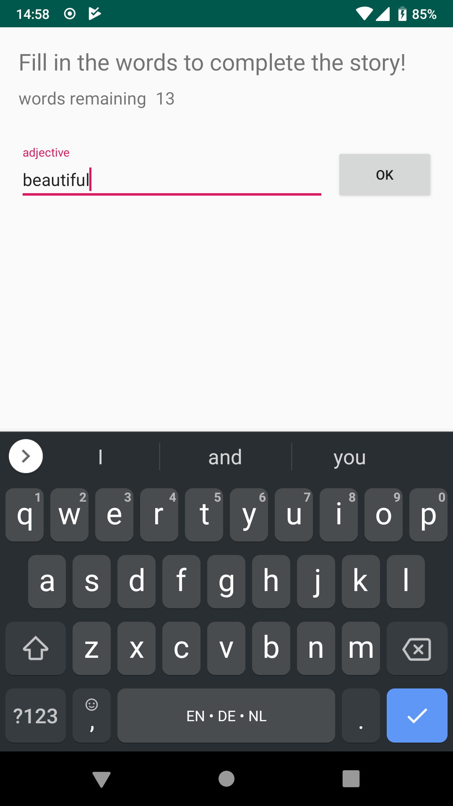
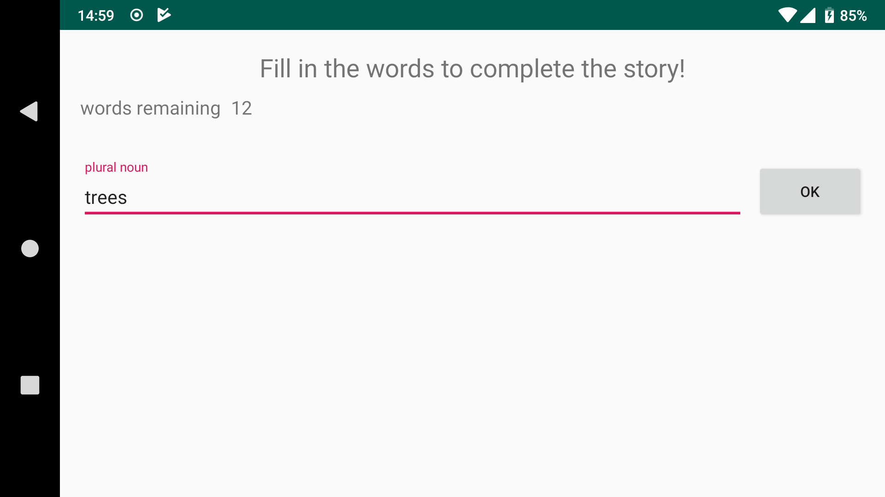
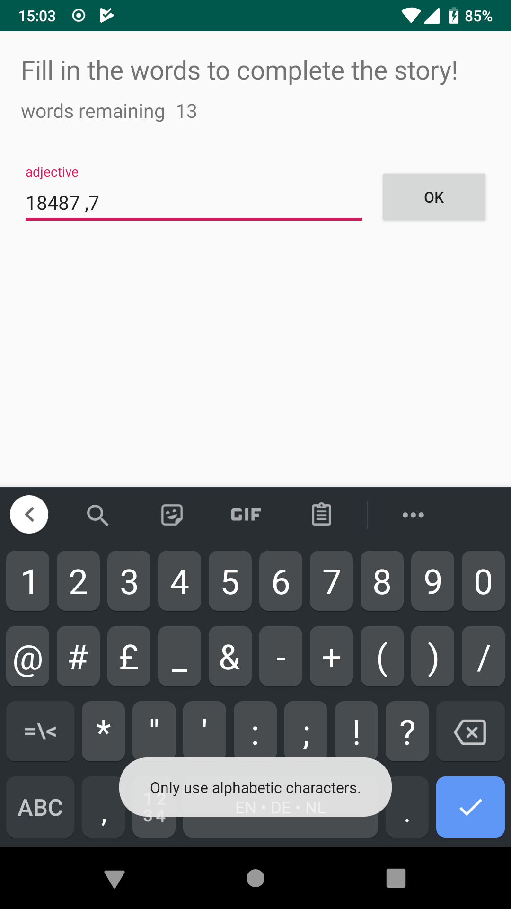
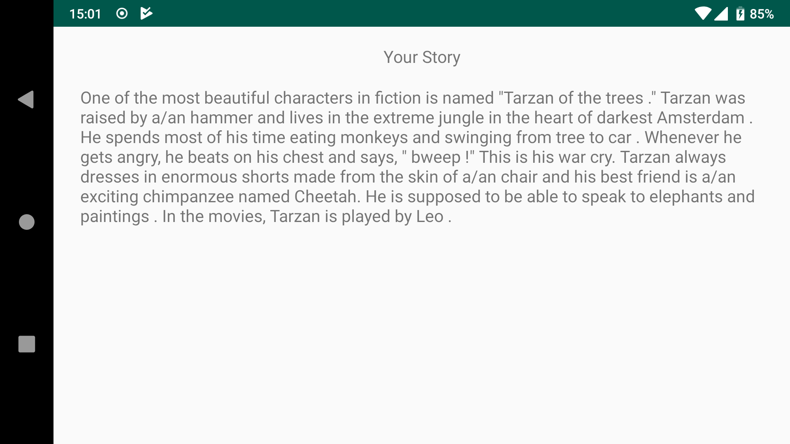

# Madlibs

Madlibs is a game where the user is asked to enter some words, after which the game presents the user with a funny story with the user's words filled in.

The user can choose one from five stories.

Only alphabetic entries are allowed.

Every part of the game also works in horizontal view, and no information is lost on rotating the device.

## Screenshots

### The intro screen

### Choose a story in horizontal view

### Fill in the words

The 'done' button on the user's keyboard is tied to the 'ok' button on the screen.

### Horizontal view of the same words filling activity

### A toast message informs the user of an incorrect entry

### Resulting story

### Resulting story in horizontal view

